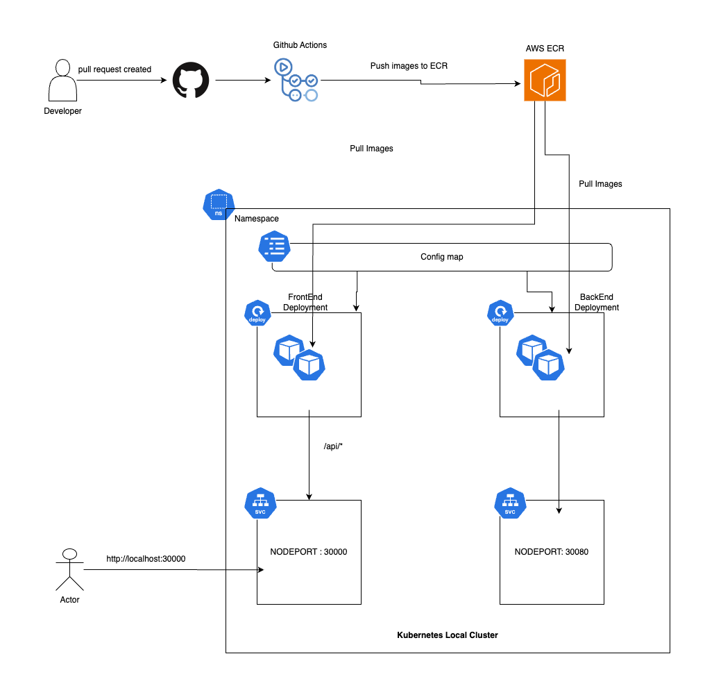
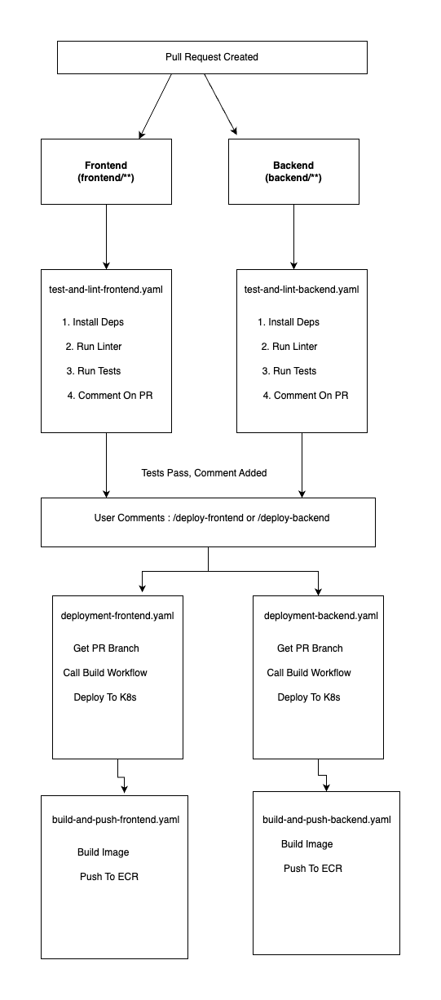

# Monitoring Dashboard Platform

A production-grade, containerized microservices-based monitoring dashboard with complete DevOps workflows.

**Repository:** [https://github.com/tarunpandey23/Monitoring-Dashboard-Platform](https://github.com/tarunpandey23/Monitoring-Dashboard-Platform)

## Table of Contents

- [Deliverables](#deliverables)
- [Project Structure](#project-structure)
- [System Architecture](#system-architecture)
- [Tech Stack & Reasoning](#tech-stack--reasoning)
- [Local Deployment Guide](#local-deployment-guide)
- [CI/CD Pipeline](#cicd-pipeline)
- [Accessing Services](#accessing-services)
- [Viewing Logs & Troubleshooting](#viewing-logs--troubleshooting)
- [Kubernetes Manifests Explained](#kubernetes-manifests-explained)
- [Complete Architecture Diagram](#complete-architecture-diagram-for-drawio)
- [Required Secrets](#required-secrets-github-actions)

---

## Deliverables

This repository includes all required components:

- **Dockerfiles** for all services (`backend/Dockerfile`, `frontend/Dockerfile`)
- **docker-compose.yml** for local development and testing
- **Kubernetes manifests** in `k8s/` directory (Deployments, Services, ConfigMaps, Namespace)
- **GitHub Actions workflows** in `.github/workflows/` directory
- **Complete documentation** in this README.md

---

## Project Structure

```
Monitoring-Dashboard-Platform/
├── backend/                          # Backend microservice
│   ├── src/
│   │   └── server.js                # Express server with /metrics endpoint
│   ├── Dockerfile                   # Multi-stage Docker build
│   ├── package.json                 # Dependencies and scripts
│   └── .dockerignore                # Files excluded from Docker build
│
├── frontend/                         # Frontend dashboard
│   ├── src/
│   │   ├── App.tsx                  # Main React component with charts
│   │   └── App.css                  # Styling
│   ├── public/                      # Static assets (HTML, images)
│   ├── Dockerfile                   # Multi-stage build (React + Express)
│   ├── server.js                    # Express proxy server for /api
│   ├── package.json                 # Dependencies
│   └── tsconfig.json                # TypeScript configuration
│
├── k8s/                              # Kubernetes manifests
│   ├── namespace.yaml               # Namespace: monitoring-platform
│   ├── configmap.yaml               # Application configuration
│   ├── backend-deployment.yaml      # Backend pod specifications
│   ├── backend-service.yaml         # Backend service (NodePort)
│   ├── frontend-deployment.yaml     # Frontend pod specifications
│   └── frontend-service.yaml        # Frontend service (NodePort)
│
├── .github/
│   └── workflows/                   # CI/CD pipelines
│       ├── test-and-lint-frontend.yml
│       ├── test-and-lint-backend.yml
│       ├── build-and-push-frontend.yml
│       ├── build-and-push-backend.yml
│       ├── deploy-frontend.yml
│       └── deploy-backend.yml
│
├── docker-compose.yaml              # Local development orchestration
├── .gitignore                       # Git ignore patterns
└── README.md                        # This documentation
```

---

## System Architecture Diagram



---

## Tech Stack & Reasoning

### Backend
- **Node.js + Express**: Fast development, JavaScript ecosystem, good for REST APIs
- **CORS enabled**: Allows frontend to make cross-origin requests
- **Port 8080**: Standard non-privileged port for containerized apps

### Frontend
- **React + TypeScript**: Component-based UI, type safety, large ecosystem
- **Recharts**: Lightweight charting library, good performance for real-time data
- **Express Server**: Simple proxy server to forward API requests (replaces nginx complexity)
- **Port 80**: Standard HTTP port

### Containerization
- **Docker**: Industry standard, multi-stage builds for smaller images
- **Alpine Linux**: Minimal base images (~5MB), reduces attack surface
- **Multi-stage builds**: Separate build and runtime environments

### Orchestration
- **Kubernetes**: Industry standard, auto-scaling, self-healing, service discovery
- **ConfigMaps**: Externalize configuration, no hardcoded values
- **NodePort Services**: Simple external access without Ingress complexity

### CI/CD
- **GitHub Actions**: Native integration, free for public repos, extensive marketplace
- **AWS ECR**: Secure container registry, integrates with AWS services
- **OIDC Authentication**: Secure, no long-lived credentials

---

## Local Deployment Guide

### Prerequisites
- Docker Desktop with Kubernetes enabled (or minikube/kind)
- Node.js 20+ installed
- kubectl configured

### Step 1: Clone Repository
```bash
git clone <repository-url>
cd Monitoring-Dashboard-Platform
```

### Step 2: Deploy with Docker Compose (Quick Start)

```bash
# Build and start services
docker-compose up -d

# Check status
docker-compose ps

# View logs
docker-compose logs -f frontend
docker-compose logs -f backend
```

**Access:**
- Frontend: http://localhost:3000
- Backend: http://localhost:8080/metrics

### Step 3: Deploy to Kubernetes (Local Cluster)

**Quick Deploy (Recommended):**
```bash
cd k8s
bash deploy.sh
```

The script automatically:
- Creates namespace
- Applies all manifests
- Waits for deployments to be ready
- Shows service access URLs

**Manual Deploy:**
```bash
kubectl apply -f k8s/
kubectl get pods -n monitoring-platform
```


### Step 4: Verify Deployment

```bash
# Check pods are running
kubectl get pods -n monitoring-platform

# Check services
kubectl get svc -n monitoring-platform

# Test backend
curl http://localhost:30080/metrics

# Test frontend
curl http://localhost:30000/health
```

---

## CI/CD Pipeline

### Pipeline Flow




### Why Manual Deployment Trigger?

The pipeline uses manual deployment triggers (PR comments) as a production best practice:

**Controlled Deployments:**
- Prevents automatic deployments during peak traffic hours
- Allows teams to coordinate deployments and avoid conflicts
- Reduces risk of deploying incomplete features or breaking changes

**Team Coordination:**
- Multiple teams can work on different features simultaneously
- Each team can deploy independently when ready
- Prevents partial feature deployments when one team merges before another

**Risk Mitigation:**
- Deployment happens only after explicit approval
- Teams can choose optimal deployment windows
- Reduces downtime risk from untested or conflicting changes

### Workflow Files Location

All workflows are in `.github/workflows/`:

1. **`test-and-lint-frontend.yml`** - Tests and lints frontend on PR, comments on PR when pass
2. **`test-and-lint-backend.yml`** - Tests and lints backend on PR, comments on PR when pass
3. **`build-and-push-frontend.yml`** - Builds and pushes frontend image to ECR
4. **`build-and-push-backend.yml`** - Builds and pushes backend image to ECR
5. **`deploy-frontend.yml`** - Deploys frontend to Kubernetes (triggered by `/deploy-frontend` comment)
6. **`deploy-backend.yml`** - Deploys backend to Kubernetes (triggered by `/deploy-backend` comment)

### Why Manual Deployment Trigger?

The pipeline uses manual deployment triggers (PR comments `/deploy-frontend` or `/deploy-backend`) as a production best practice:

**Controlled Deployments:**
- Prevents automatic deployments during peak traffic hours
- Allows teams to coordinate deployments and avoid conflicts
- Reduces risk of deploying incomplete features or breaking changes

**Team Coordination:**
- Multiple teams can work on different features simultaneously
- Each team can deploy independently when ready
- Prevents partial feature deployments when one team merges before another

**Risk Mitigation:**
- Deployment happens only after explicit approval
- Teams can choose optimal deployment windows
- Reduces downtime risk from untested or conflicting changes

### Best Practices Implemented

- **Separation of Concerns**: Separate workflows for test, build, and deploy  
- **Conditional Execution**: Tests only run when relevant files change  
- **Reusable Workflows**: Build workflows are reusable via `workflow_call`  
- **Security**: OIDC authentication, no hardcoded secrets  
- **Multi-platform Builds**: Supports amd64 and arm64 architectures  
- **Image Tagging**: SHA-based tags for traceability  
- **Rolling Updates**: Kubernetes handles zero-downtime deployments  
- **Health Checks**: Liveness and readiness probes configured  
- **Resource Limits**: CPU and memory limits set for pods  
- **Manual Deployment Gates**: Controlled deployments via PR comments

### Additional Best Practices for Production

**External Secrets Operator (ESO) with AWS SSM Parameter Store:**
- Fetch credentials and configuration from AWS SSM Parameter Store via External Secrets Operator
- Eliminates need to manually update ConfigMaps and Secrets
- Centralized secret management with automatic synchronization
- Reduces risk of exposing secrets in Git or manual updates

**Helm for Multi-Environment Deployments:**
- Use Helm charts for managing deployments across multiple environments (dev, staging, prod)
- Template-based configuration allows environment-specific values
- Simplifies versioning and rollback capabilities
- Enables consistent deployments across environments

**Automated Configuration Updates:**
- Workflows can update values in SSM Parameter Store
- Automatically annotate deployments to trigger restarts
- Eliminates manual intervention for configuration changes
- Ensures deployments stay in sync with updated parameters

### Note: Local Kubernetes Deployment via GitHub Actions

The current pipeline is configured for remote Kubernetes clusters (EKS) accessible from the internet. GitHub Actions runs on cloud-hosted runners that cannot directly access local clusters.

**Current Configuration:**
- AWS ECR for container registry
- Remote cluster access via `kubectl` with `KUBECONFIG` secret
- AWS IAM roles for authentication

**Local Cluster Options:**
- **Self-Hosted Runner**: Install runner in local network for direct cluster access
- **Expose API Server**: Expose local API server to internet with authentication

For local testing, use `docker-compose` or `kubectl apply` directly.

---

## Accessing Services

### Docker Compose
- **Frontend**: http://localhost:3000
- **Backend API**: http://localhost:8080/metrics
- **Backend Health**: http://localhost:8080/health

### Kubernetes (Local)
- **Frontend**: http://localhost:30000
- **Backend API**: http://localhost:30080/metrics
- **Backend Health**: http://localhost:30080/health

### Kubernetes (Remote/EKS)
- **Frontend**: `http://<node-ip>:30000` or via LoadBalancer/Ingress
- **Backend API**: `http://<node-ip>:30080/metrics`

**Find Node IP:**
```bash
kubectl get nodes -o wide
```

---

## Viewing Logs & Troubleshooting

### Docker Compose Logs

```bash
# All services
docker-compose logs -f

# Specific service
docker-compose logs -f frontend
docker-compose logs -f backend

# Last 100 lines
docker-compose logs --tail=100 frontend
```

### Kubernetes Logs

```bash
# All pods in namespace
kubectl logs -f -n monitoring-platform --all-containers=true

# Specific pod
kubectl logs -f -n monitoring-platform <pod-name>

# Specific deployment
kubectl logs -f -n monitoring-platform deployment/frontend
kubectl logs -f -n monitoring-platform deployment/backend

# Previous container instance (if crashed)
kubectl logs -f -n monitoring-platform <pod-name> --previous
```

### Common Issues & Solutions

**Pods in CrashLoopBackOff:**
```bash
# Check pod events
kubectl describe pod <pod-name> -n monitoring-platform

# Check logs
kubectl logs <pod-name> -n monitoring-platform

# Common causes:
# - Image pull errors (check image name/tag)
# - Resource limits too low
# - Configuration errors
```

**Services not accessible:**
```bash
# Check service endpoints
kubectl get endpoints -n monitoring-platform

# Check service selector matches pod labels
kubectl get svc -n monitoring-platform -o yaml
kubectl get pods -n monitoring-platform --show-labels
```

**Image pull errors:**
```bash
# Check image exists in ECR
aws ecr describe-images --repository-name monitoring-frontend --region ap-south-1

# Verify imagePullPolicy
kubectl get deployment -n monitoring-platform -o yaml | grep imagePullPolicy
```

**Port already in use:**
```bash
# Check what's using the port
lsof -i :30000
lsof -i :30080

# Change NodePort in service YAML if needed
```

---

## Kubernetes Manifests Explained

All Kubernetes manifests are located in the `k8s/` directory:

### File Structure

```
k8s/
├── namespace.yaml              # Namespace definition
├── configmap.yaml              # Application configuration
├── backend-deployment.yaml     # Backend pod specifications
├── backend-service.yaml       # Backend service (NodePort)
├── frontend-deployment.yaml    # Frontend pod specifications
└── frontend-service.yaml       # Frontend service (NodePort)
```

### 1. `namespace.yaml`
**Purpose**: Isolates resources in a dedicated namespace  
**Why**: Better organization, resource quotas, RBAC isolation  
**Key Fields**:
- `name: monitoring-platform` - Namespace identifier

### 2. `configmap.yaml`
**Purpose**: Stores non-sensitive configuration data  
**Why**: Externalize config, no hardcoded values, easy updates  
**Key Fields**:
- `REACT_APP_BACKEND_URL: "/api"` - Frontend API endpoint
- `BACKEND_PORT: "8080"` - Backend port
- `POLL_INTERVAL: "10000"` - Frontend polling interval

**Usage**: Pods reference ConfigMap via environment variables

### 3. `backend-deployment.yaml`
**Purpose**: Defines backend pod template and scaling  
**Key Components**:
- **Replicas**: 2 (high availability)
- **Image**: ECR image (updated by CI/CD)
- **Resources**: CPU/memory requests and limits
- **Probes**: Liveness and readiness health checks
- **Security**: Non-root user, dropped capabilities

**Flow**: Deployment → ReplicaSet → Pods

### 4. `backend-service.yaml`
**Purpose**: Exposes backend pods as a network service  
**Type**: NodePort (accessible from outside cluster)  
**Key Fields**:
- `port: 8080` - Service port
- `targetPort: 8080` - Pod port
- `nodePort: 30080` - External access port

**Flow**: External Request → NodePort 30080 → Service → Pod

### 5. `frontend-deployment.yaml`
**Purpose**: Defines frontend pod template  
**Similar to backend** but:
- Uses ConfigMap for nginx config (if using nginx)
- Environment variables for React build-time config
- Different resource limits (frontend is lighter)

### 6. `frontend-service.yaml`
**Purpose**: Exposes frontend pods  
**Type**: NodePort  
**Key Fields**:
- `nodePort: 30000` - External access port

### Deployment Flow

```
1. Apply namespace.yaml
    Creates monitoring-platform namespace

2. Apply configmap.yaml
    Stores configuration data

3. Apply backend-deployment.yaml
     Creates Deployment
       Creates ReplicaSet
           Creates 2 Pods
               Pulls image from ECR
                   Starts containers

4. Apply backend-service.yaml
    Creates Service
        Selects pods by labels
           Exposes on NodePort 30080

5. Apply frontend-deployment.yaml
     Similar flow as backend

6. Apply frontend-service.yaml
    Exposes on NodePort 30000
```


---


## Required Secrets (GitHub Actions)

Configure these in: **Settings → Secrets and variables → Actions**

- `AWS_IAM_ROLE_ARN` - AWS IAM role for ECR access (OIDC)
- `KUBECONFIG` - Base64 encoded kubeconfig for Kubernetes access

---
### Screenshots


